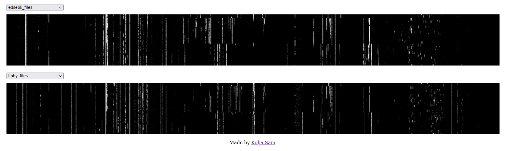

# All the ISBNs

This is my demo for the [ISBN visualization bounty by Anna's Archive](https://annas-archive.org/blog/all-isbns.html).

**You can see it in action [here](https://koljapluemer.github.io/isbns/)**

## Concept

Alas, this project ended up more in a demo stage than in a worthy-submission-stage.
It uses `deck.gl` and tilemaps to render Anna's datasets of ISBNs.

My main "invention" is that you can easily compare multiple datasets with two views which pan and zoom in lockstep.

I think this visualization may have some potential, and you are invited to build on it — for example by generating the tiles in full quality, which my puny laptop can't. 

## Usage

The visualization itself is the HTML files `src/visualization.html`. 

You can use it as a standalone page, or copy it into any other HTML website. If you use it as a snippet, you probably want to delete the `<head>` statements, move the css (and js) in dedicated files and do similar housekeeping.

The `tiles/` folder is required to actually show anything. If you change the path, `Ctrl+F` for `tiles` in the html file and change the path string there.

As per the MIT license, you are of course invited to change anything you like in the code. I appreciate credit, but don't sweat it :)

### Scripts

The `scripts/` folder contains all the code I used to ready the data for visualization.
If you wish to execute them, follow the instructions below, then simply run them in order.

For the python scripts, install the requirements in `requirements.txt` and run them with `python3`. They are inspired by the original scripts provided by Anna.

The singular python script is adapted from [Wytamma's submission](https://github.com/Wytamma/isbns/tree/main). Make it executable and run it in a terminal.

For the scripts to work, you'll need the Anna file with the ISBN data, as `src/data/aa_isbn13_codes_20241204T185335Z.benc.zst` and [this publisher ranges file]() as `src/data/publishers.jsonl`.

## Credit

- [Anna's Archive](https://annas-archive.org/) and its contributors for the challenge, data and scripts
- [Wytamma's submission](https://github.com/Wytamma/isbns), which inspired my technical approach and provided some useful code freely.
- `vue.js`, `js`, `ts`, `python`, `HTML`, `CSS`, `Google Colab`, `bencode.py`, `numpy`, `OpenSeaDragon`, `deck.gl`, `OpenLayers Zoomify` and all the other tech I used experimenting with this
